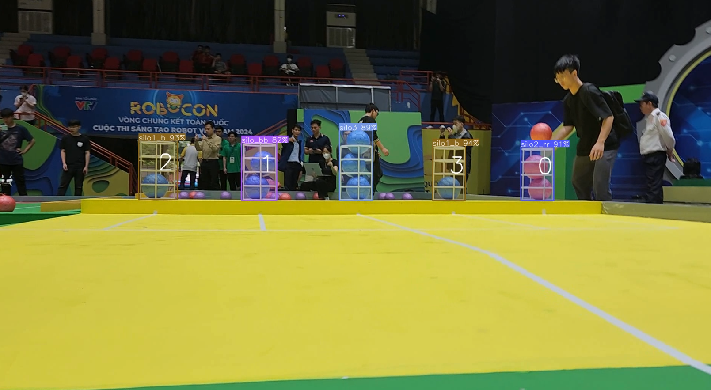

# Important
- The input images are directly resized to match the input size of the model. I skipped adding the pad to the input image, it might affect the accuracy of the model if the input image has a different aspect ratio compared to the input size of the model. Always try to get an input size with a ratio close to the input images you will use.

# Requirements

 * Check the **requirements.txt** file.
 * For ONNX, if you have a NVIDIA GPU, then install the **onnxruntime-gpu**, otherwise use the **onnxruntime** library.

# Installation
```shell
git clone -b Robocon2024 https://github.com/AidenDam/yolov8_inference.git
cd yolov8_inference
pip install -r requirements.txt
```
### ONNX Runtime
For Nvidia GPU computers:
`pip install onnxruntime-gpu`

Otherwise:
`pip install onnxruntime`

# ONNX model
Use the Google Colab notebook to convert the yolov8 model: [](https://colab.research.google.com/drive/1-yZg6hFg27uCPSycRCRtyezHhq_VAHxQ?usp=sharing), or following [this docs](https://docs.ultralytics.com/modes/export/#key-features-of-export-mode).

You can convert the model using the following code after installing ultralitics (`pip install ultralytics`) (this code export model FP16 for Jetson TX2):
```python
from ultralytics import YOLO

model = YOLO("yolov8m.pt")
model.to('cuda')
model.export(format="onnx", imgsz=480, half=True, opset=16)
```

[//]: # (The original models were converted to different formats &#40;including .onnx&#41; by [PINTO0309]&#40;https://github.com/PINTO0309&#41;. Download the models from **[his repository]**&#40;https://github.com/PINTO0309/PINTO_model_zoo/tree/main/345_YOLOv8&#41;. For that, you can either run the `download_single_batch.sh` or copy the download link inside that script in your browser to manually download the file. Then, extract and copy the downloaded onnx models &#40;for example `yolov8m_480x640.onnx`&#41; to your **[models directory]&#40;https://github.com/ibaiGorordo/ONNX-YOLOv8-Object-Detection/tree/main/models&#41;**, and fix the file name in the python scripts accordingly.)

# Containerization with docker

### Build docker image
```bash
DOCKER_BUILDKIT=1 docker build -t <image_name> -f Dockerfile.jetson .
```

### Run docker container
```bash
docker run -it --rm \
  --gpus all \
  --runtime nvidia \
  --device /dev/video0:/dev/video0 \
  --device /dev/video1:/dev/video1 \
  --device /dev/ttyUSB0:/dev/ttyUSB0 \
  --env ORT_TENSORRT_FP16_ENABLE=1 \
  --env DISPLAY=$DISPLAY -v /tmp/.X11-unix:/tmp/.X11-unix -v $(pwd):/code \
  --env ORT_TENSORRT_ENGINE_CACHE_ENABLE=1 \
  --env ORT_TENSORRT_CACHE_PATH=/code/cache \
  <image_name>
```

### Run inference
```bash
source /venv/bin/activate && python main.py [-b]
```

### Notice
* If you encounter with error related to qt.qpa.xcb, try run command bellow before run inference:
  ```bash
  xhost +local:docker
  ```
* You can also run with my builded image form [my docker hub](https://hub.docker.com/repository/docker/aiden827/yolov8_onnx/general):\
  *Example run docker container in Jetson:*
  ```bash
  docker run -it --rm \
    --gpus all \
    --runtime nvidia \
    --device /dev/video0:/dev/video0 \
    --device /dev/video1:/dev/video1 \
    --device /dev/ttyUSB0:/dev/ttyUSB0 \
    --env ORT_TENSORRT_FP16_ENABLE=1 \
    --env DISPLAY=$DISPLAY -v /tmp/.X11-unix:/tmp/.X11-unix -v $(pwd):/code \
    --env ORT_TENSORRT_ENGINE_CACHE_ENABLE=1 \
    --env ORT_TENSORRT_CACHE_PATH=/code/cache \
    aiden827/yolov8_onnx:jetson
  ```

# References:
* YOLOv8 model: [https://github.com/ultralytics/ultralytics](https://github.com/ultralytics/ultralytics)
* Jetson zoo: [https://elinux.org/Jetson_Zoo](https://elinux.org/Jetson_Zoo)
* ONNX-YOLOv8-Object-Detection: [https://github.com/ibaiGorordo/ONNX-YOLOv8-Object-Detection](https://github.com/ibaiGorordo/ONNX-YOLOv8-Object-Detection/tree/main)
* TensorRT Execution Provider: [https://onnxruntime.ai/docs/execution-providers/TensorRT-ExecutionProvider.html](https://onnxruntime.ai/docs/execution-providers/TensorRT-ExecutionProvider.html)